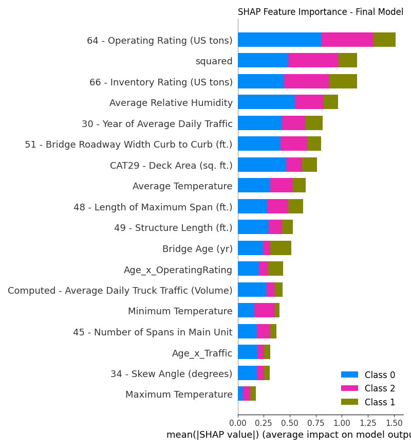

# BridgeSense | A Structural Integrity Forecast Engine

## Problem Statement <!--- do not change this line -->

*This project's goal is to predict if a bridge will receive a 'Poor' condition rating, using available NBI features like traffic, environmental factors, and material type. Given that a poor rating indicates serious problems that may lead to failure, this prediction provides critical insight that can be used proactively to take active measures and avoid collapse, rather than waiting for the scheduled times where bridges are inspected.*

## Key Results <!--- do not change this line -->

- *Examined over 500,000 data points of bridges in Georgia from 1900 to 2022.*
- *Identified three biases*
   - *Inspection Frequency Bias: Depending on how often bridges were inspected due to various factors such as location and economics, results may skew toward bridges that get inspected more often.*
   - *Geographic Bias: There will be some unpredictable factors that alter the result, which decreases the validity of the study.*
   - *Algorithmic Bias: It may ignore outliers, misjudge whether or not it is a linear relationship,  and may ignore multiple factors that influence the outcome.*
- *Evaluated four distinct modeling approaches: Random Forest, XGBoost, CatBoost, and a soft-voting Ensemble of all three.*
   - *XGBoost was selected as the final champion model. While the Ensemble model achieved a slightly higher F1-score for the "Poor" class, XGBoost was chosen for its significantly superior and unmatched 90% Recall*
- *Final XGBoost SHAP analysis*
   - *Class 0: Poor, Class 1: Fair, Class 2: Good*
   - *Bridge Age, Operating Rating, and Inventory Rating were identified as the most significant predictors of structural condition*
     

## Methodologies <!--- do not change this line -->

- *Feature Engineering: Automated feature selection with RFECV and created interaction/non-linear features*

- *Class Imbalance: Handled using SMOTE and Class Weighting*

- *Hyperparameter Tuning: Optimized models using Optuna (Bayesian Optimization)*

- *Model Interpretability: Explained model predictions using SHAP*

- *Model Deployment: Deployed the final model as an interactive web application*

## Data Sources <!--- do not change this line -->

*Kaggle NBI Datasets ([https://www.fhwa.dot.gov/bridge/nbi/ascii.cfm](https://www.fhwa.dot.gov/bridge/nbi/ascii.cfm))*

## Technologies Used <!--- do not change this line -->

- Core Stack: *Python, Pandas, NumPy, Scikit-learn*

- ML Libraries: *XGBoost, CatBoost, Imbalanced-learn, Optuna, SHAP*

- Deployment & Tools: *Streamlit, Joblib, VS Code, Git, Git LFS*

- Visualization: *Matplotlib, Seaborn*

## Authors <!--- do not change this line -->

*This project was completed in collaboration with:*
- *Julia Xi ([julia.wm63@gmail.com](julia.wm63@gmail.com))*
- *Jingzhi Chen ([cjzmimosapudical@gmail.com](cjzmimosapudical@gmail.com))*

